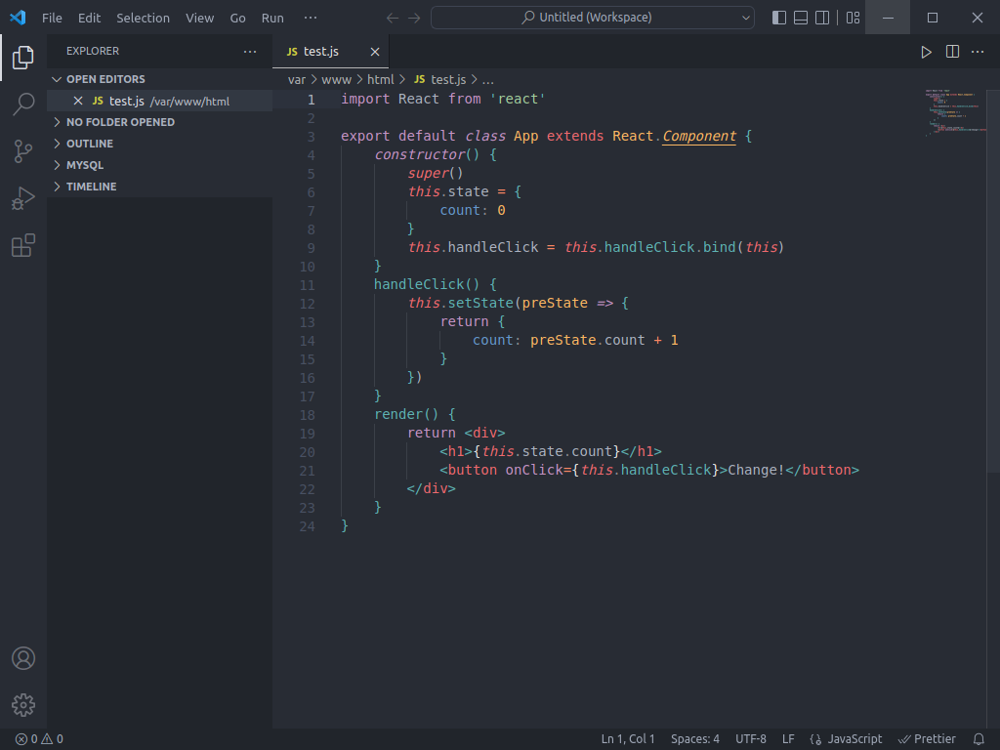
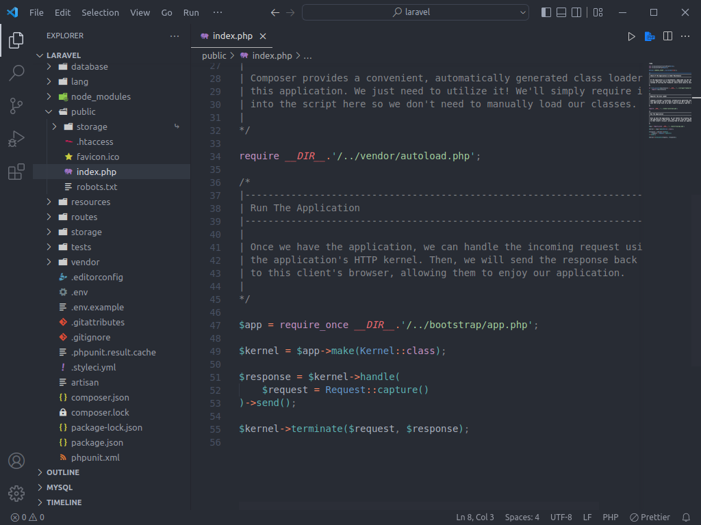
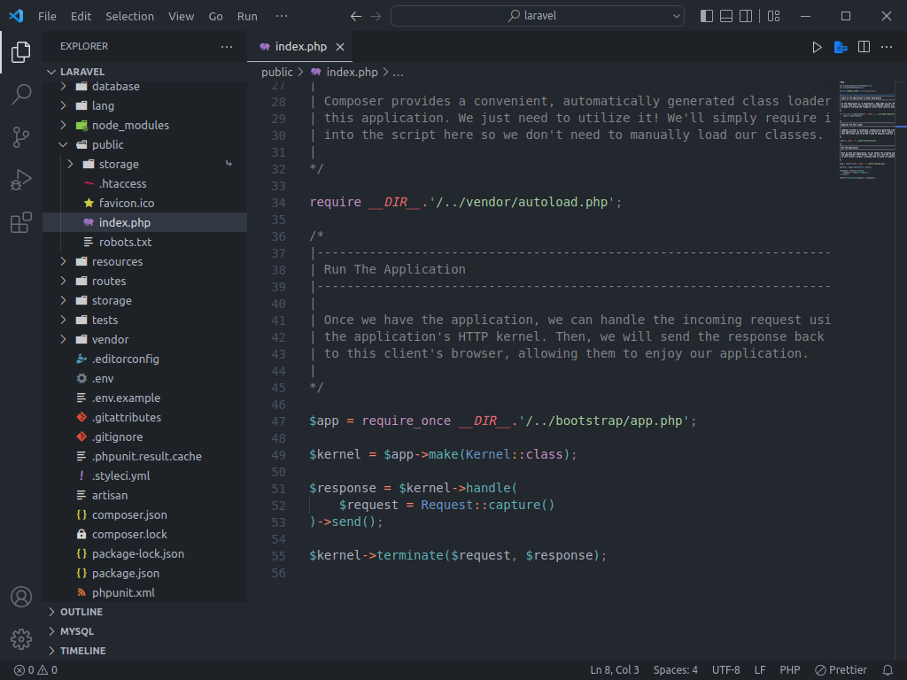
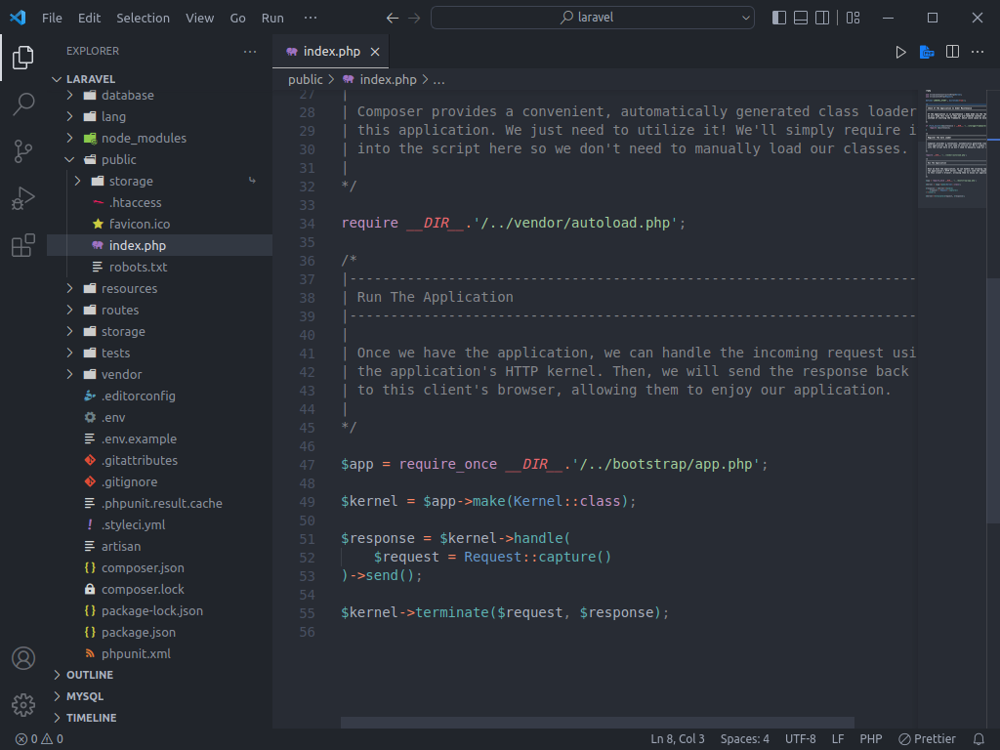

 

# OneDarkPro Mariana VSCode

**One Dark Pro** `3.15.8` theme with the **Mariana** color syntax highlight for users who likes to have Mariana scheme just like Sublime Text

>Note: This theme is based on [One Dark Pro](https://github.com/Binaryify/OneDark-Pro).

## ScreenShots
One Dark Pro - Mariana: Default

One Dark Pro - Mariana: Flat

One Dark Pro - Mariana: Darker

One Dark Pro - Mariana: Mix

